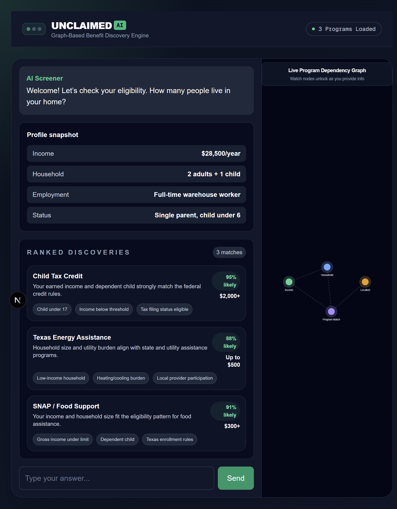

# unclaimed

AI Powered Claim & Benefits Recommender

This project is a Next.js + Tailwind frontend for an AI-driven benefits discovery engine. It helps users identify eligibility for assistance programs, tax credits, and benefits based on household income, employment, location, and other personal context.

The UI is designed as a split-screen dashboard with:
- a left-side chat and profile panel for user input and eligibility insights
- a right-side live program dependency graph visualization
- ranked discovery cards showing likely benefits and claim guidance

## Screenshot

## How to run

1. Navigate to the `frontend` folder.
2. Install dependencies with `npm install`.
3. Start the app with `npm run dev`.

The screenshot above shows the current interface and should appear once the app is running locally.
