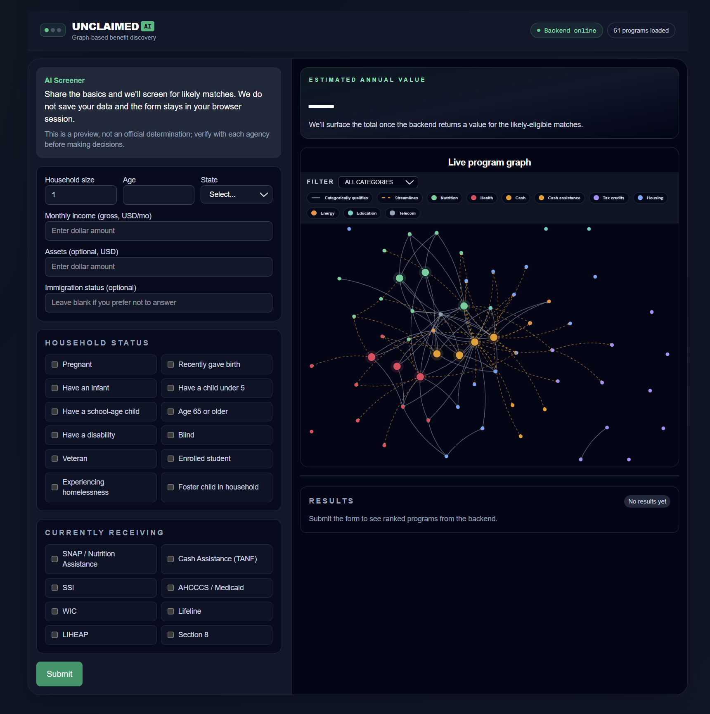
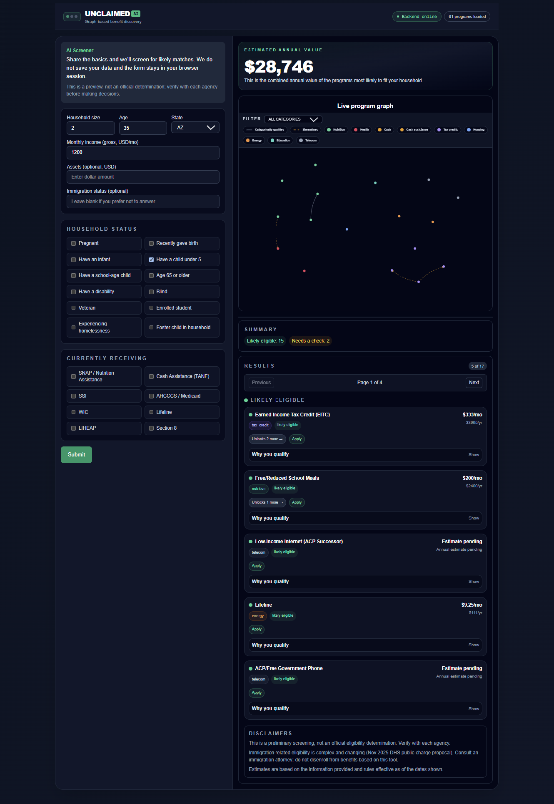
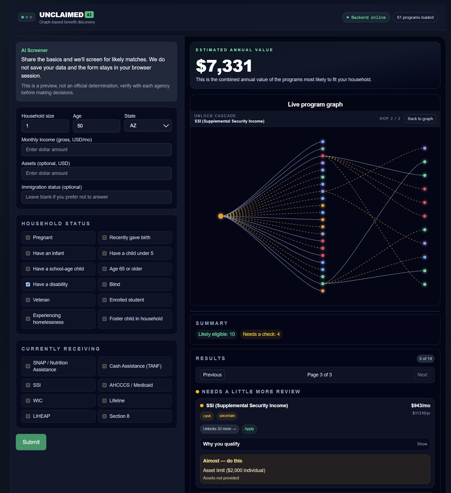
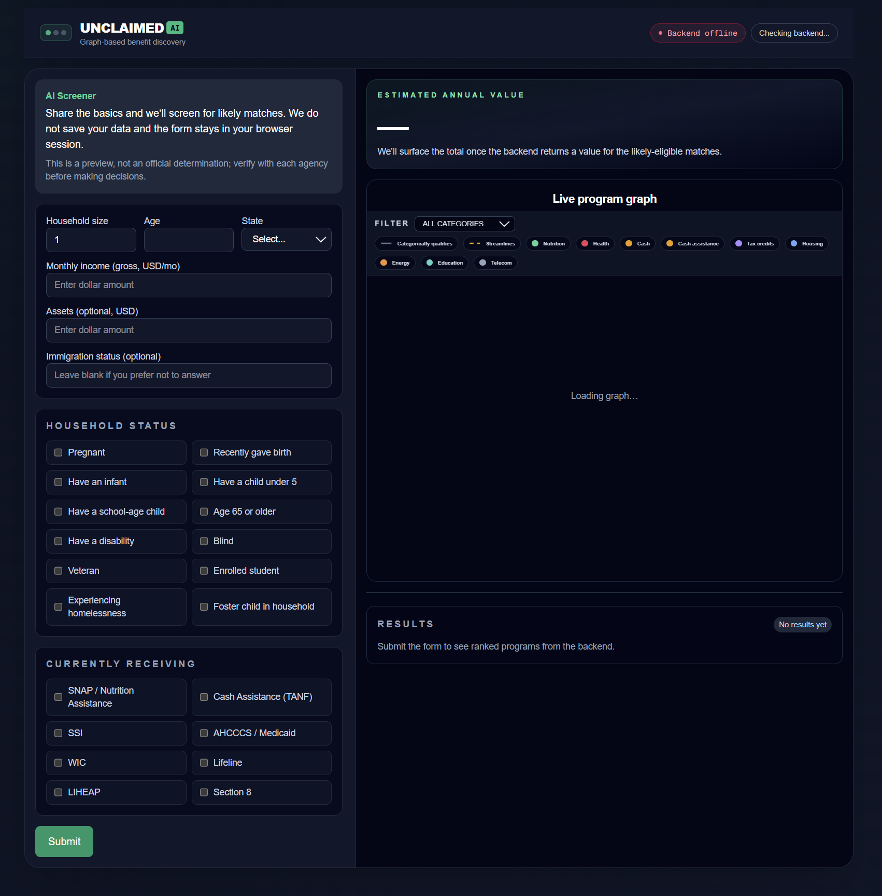

# unclaimed

AI Powered Claim & Benefits Recommender

This project is a Next.js + Tailwind frontend for an AI-driven benefits discovery engine. It helps users identify eligibility for assistance programs, tax credits, and benefits based on household income, employment, location, and other personal context.

## Project Pitch

Millions of families miss out on life-changing support because the safety net is hard to navigate, fragmented, and full of hidden dependencies.

Unclaimed is an AI-powered benefits copilot that turns a complex eligibility maze into clear, actionable next steps.

In one flow, users can:
- share their household context through a guided intake
- see ranked likely-eligible programs with transparent "why" explanations and citations
- understand estimated annual value of unclaimed benefits
- visualize how enrolling in one program can unlock others through a live dependency graph and cascade view

Unclaimed helps people move from confusion to confidence and from missed support to claimed support.

## Demo

<video src="UnclaimedDemo.mp4" title="Demonstration of the Unclaimed: a benefits copilot workflow" controls width="100%"></video>
_If the video player above does not load, it showcases the Unclaimed: a benefits copilot workflow._

## 2-Minute Demo Script

### 0:00-0:20
Today I’m showing Unclaimed, an AI-powered benefits copilot.
The problem is simple: millions of people qualify for support but never claim it because the system is fragmented and hard to navigate.
Unclaimed turns that complexity into clear, actionable next steps.
Currently, this demo focuses on US-based programs but could be expanded worldwide.

### 0:20-0:45
On the left, I am going to go ahead and enter some household details into this form.
Just give me one moment to do that. 
And once I hit submit into this guided intake form, which is intentionally lightweight so people can start quickly, the left side is going to update, showing results.

### 0:45-1:00
Each card shows estimated monthly and annual value, plus a verdict status like likely eligible or needs review.
The key trust feature is Why you qualify, where each recommendation includes rule-based reasoning and source citation.

### 1:00-1:21
Above the results is a live graph program. 
This visual shows the benefits are connected, not isolated. 
If I filter, which I'm going to do for cash here in a moment, the graph and the results stay in sync.
So the user can focus on exactly what matters.

### 1:21-1:40
Now let's look at the money shot: Unlocks 33 more. 
Clicking it opens a cascade view of that program and reveals downstream opportunities, hop by hop.
The edges are styled by relationship types, so you can immediately distinguish direct categorical qualifications from streamlined pathways. 

### 1:40-1:52
So instead of asking people to decode policy complexity, Unclaimed gives them a prioritized path, what they likely qualify for now, why, and what to do next to unlock more support.

## Screenshots

### Empty Intake State

The initial dashboard state before any household details are entered.



### Submitted Intake State

The filled intake state after submitting core household and income details.



### Cascade Discovery State

The cascade view opened from a selected program, showing downstream opportunities unlocked hop-by-hop.



### Offline Fallback State

The offline-mode dashboard showing fallback recommendations when the backend is unavailable.



## Quick Start

### Backend

**With Docker (recommended):**

```bash
cd backend
cp .env.example .env   # fill in your API keys
docker compose up --build
```

**Without Docker:**

```bash
cd backend
cp .env.example .env   # fill in your API keys
make sync              # install dependencies (requires uv)
make run               # starts server on port 8000
```

API available at `http://localhost:8000`. See `docs/API_SPEC.md` for endpoints.

**Run tests:**

```bash
make test
```

### Frontend

```bash
cd frontend
npm install
npm run dev
```
