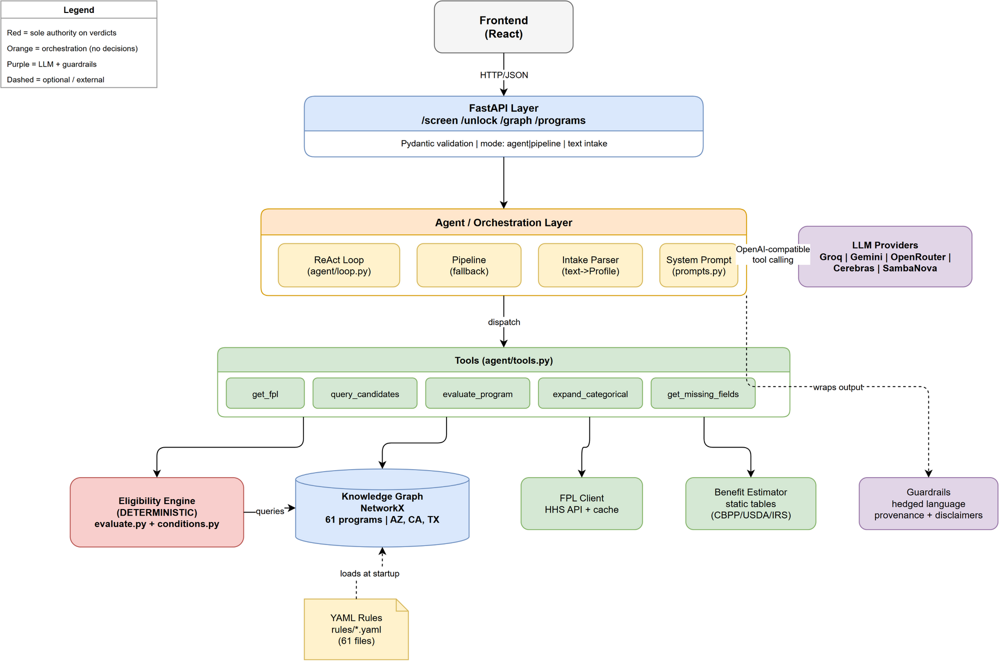
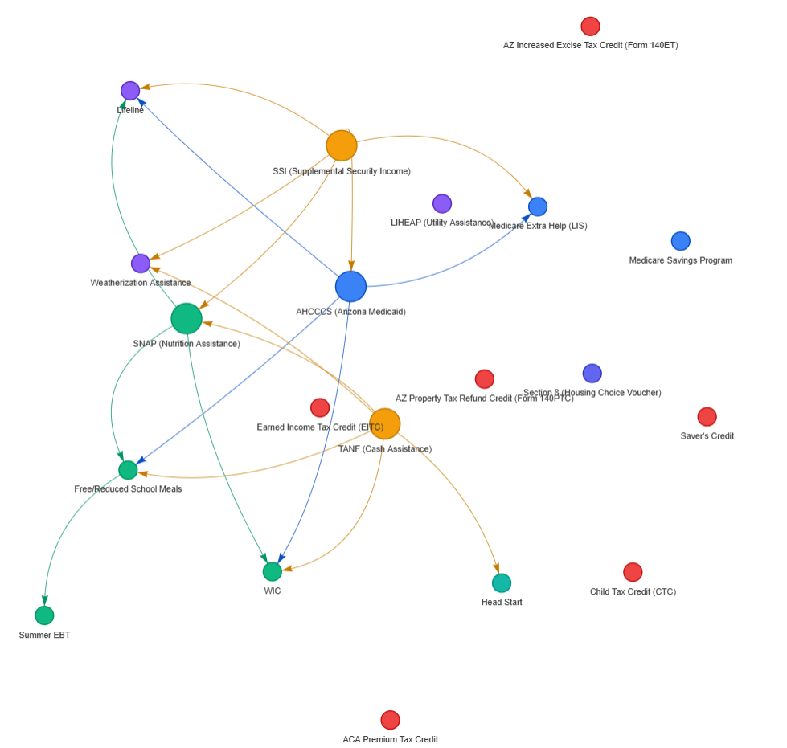

# Unclaimed - Backend

AI agent that finds unclaimed government benefits via knowledge-graph reasoning. Models eligibility as a graph and reasons over it with multi-hop categorical logic ("if I enroll in SSI, what else unlocks?").

**61 programs** across 3 states (AZ, CA, TX) + federal. Covers nutrition, health, housing, tax credits, childcare, education, veterans, disability, energy, telecom, and more.

## Quick Start

```bash
# Install dependencies
uv sync

# Copy env template and fill in your LLM provider keys
cp .env.example .env

# Run the server
make run
# or: uv run uvicorn app.main:app --reload

# Verify
curl http://localhost:8000/health
```

## Endpoints

| Method | Path | Purpose |
|--------|------|---------|
| GET | `/health` | Liveness check |
| POST | `/screen` | Situation -> ranked eligibility results (supports `mode: "agent"\|"pipeline"`) |
| POST | `/unlock` | "If I enroll in X, what unlocks?" cascade |
| GET | `/graph` | Program graph for visualization (filterable by `category`) |
| GET | `/programs` | Program catalog (filterable by `category`, `jurisdiction`, `hub`) |

### Sample requests

```bash
# Screen a household (pipeline mode, default - no LLM needed)
curl -X POST http://localhost:8000/screen \
  -H "Content-Type: application/json" \
  -d '{"profile":{"household_size":3,"monthly_income":2000,"state":"AZ","categories":["has_child_under_5","has_child","pregnant"],"enrolled_in":["ssi"]}}'

# Screen with agent mode (requires LLM API key, adds NL explanation)
curl -X POST http://localhost:8000/screen \
  -H "Content-Type: application/json" \
  -d '{"profile":{"household_size":3,"monthly_income":2000,"state":"AZ","categories":["has_child_under_5","has_child","pregnant"],"enrolled_in":["ssi"]},"mode":"agent"}'

# Freeform text intake (requires LLM API key, parses text -> profile -> screen)
curl -X POST http://localhost:8000/screen \
  -H "Content-Type: application/json" \
  -d '{"text":"single mom, 2 kids, about 2k per month, Phoenix AZ, pregnant, on SSI","mode":"agent"}'

# SSI unlock cascade
curl -X POST http://localhost:8000/unlock \
  -H "Content-Type: application/json" \
  -d '{"program_id":"ssi"}'

# Full program graph
curl http://localhost:8000/graph

# Hub programs only
curl http://localhost:8000/programs?hub=true

# California resident
curl -X POST http://localhost:8000/screen \
  -H "Content-Type: application/json" \
  -d '{"profile":{"household_size":2,"monthly_income":1500,"state":"CA","categories":["has_child_under_5"]}}'

# Texas resident
curl -X POST http://localhost:8000/screen \
  -H "Content-Type: application/json" \
  -d '{"profile":{"household_size":4,"monthly_income":2500,"state":"TX","categories":["has_child","pregnant"]}}'
```

## Make Targets

```
make sync   # install deps
make run    # dev server with reload
make test   # pytest
make graph  # interactive graph visualization (graph.html)
make clean  # remove caches
```

## Tech Stack

| Concern | Choice |
|---------|--------|
| Language | Python 3.11+ |
| Package manager | uv |
| API | FastAPI + Pydantic |
| Graph store | NetworkX |
| LLM | OpenAI-compatible (Groq, Together, Gemini, Ollama) |
| Rules format | YAML (one file per program) |
| Tests | pytest |

## How the Engine Works

```
Profile in
    |
    v
1. Auto-qualify check
   Enrolled in SSI? -> automatically eligible for Medicaid, SNAP, Lifeline... (skip income checks)
    |
    v
2. Partial credit from other programs
   Enrolled in SNAP? -> satisfies WIC's income test (but not its other conditions)
    |
    v
3. Evaluate remaining conditions
   Same logic_group = OR (any passes), groups AND'd together
   verifiable:false -> "uncertain" (needs agency verification)
    |
    v
4. Verdict
   Hard gate failed -> ineligible
   Unverifiable remaining -> uncertain
   All passed -> likely_eligible
```

No LLM decides eligibility. The graph is the source of truth.

## Agent Mode

With `"mode": "agent"` on `/screen`, the system runs the same deterministic engine but adds:
- LLM-generated natural-language explanation grounded in actual matched conditions
- Freeform text intake (send `"text"` instead of `"profile"`)
- Automatic fallback to pipeline mode if no LLM provider is available

Configure providers via `.env` (any one is sufficient):
```
GROQ_API_KEY=...
GEMINI_API_KEY=...
OPENROUTER_API_KEY=...
CEREBRAS_API_KEY=...
SAMBANOVA_API_KEY=...
```

## Benefit Estimates

Each result includes `estimated_benefit` with approximate annual/monthly dollar values based on published averages (CBPP, USDA, IRS). The summary includes `estimated_total_annual` across all likely-eligible programs.

## Multi-State Support

Programs are gated by `jurisdiction`. Currently supported:
- **AZ** (32 programs) - primary, most comprehensive
- **CA** (5 state-specific: CalFresh, Medi-Cal, CalWORKs, CalEITC, YCTC)
- **TX** (5 state-specific: SNAP, Medicaid, TANF, CHIP, WIC)
- **Federal** (shared across all states)

Set `"state": "CA"` or `"state": "TX"` in the profile to get state-specific results.

# Architecture



# Knowledge Graph

